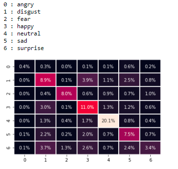
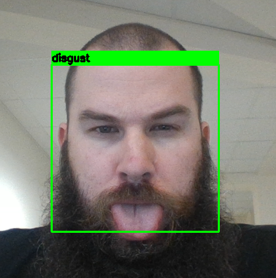
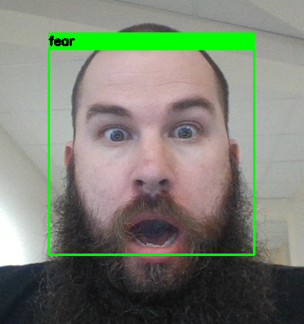
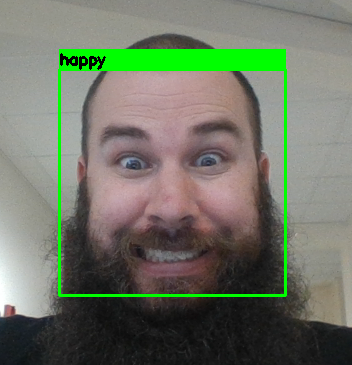
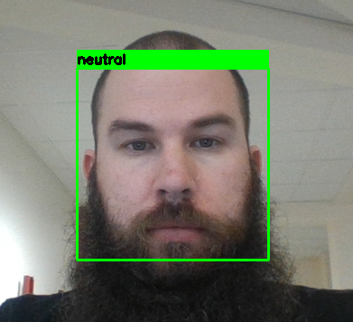
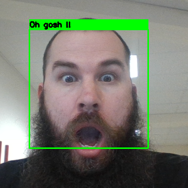

# Détecteur des émotions par les expressions faciales

## Contexte du projet

Les expressions du visage peuvent naturellement servirent à évaluer la satisfaction d’un client aux prises avec un service après-vente ou à face à un produit récemment acquis dont il s’agit de comprendre le fonctionnement. On peut encore mentionner les applications suivantes :

* La détection d’un manque d’attention chez un conducteur en vue d’augmenter la sécurité de la conduite.
* L’évaluation du niveau de stress de passagers à l’atterrissage ou à l’arrivé en gare ou la détection de comportements suspects.
* L’humanisation des robots dans leurs interactions avec les humains dont ils prendraient en compte l’état psychique.

## Description des données

Le dataset d'images contenait un jeu de test et un jeu d'entrainement. 

Chaque dataset était réparti entre 7 émotions:
* dégoût 
* tristesse
* surprise
* neutre
* heureux
* colère
* peur

Le trainset contenait 28709 images et le testset 7177. 

## Entrainement du modèle

Pour le modèle, un CNN a été utilisé avec plusieurs paramètrages différents:
* 3 couches de convolution
* 4 couches  

Après entrainement du modèle, on obtient une efficacité maximale de 60% avec une répartition assez inéquitable entre les classes.

Cela peut s'expliquer par la répartition du jeu d'images. 

Comme on peut le voir, il y a très peu de *disgust* et énormément d'*happy*.

## Traitement vidéo

### Dégoût

### Peur

### Heureux

### Neutre

Trois problèmes sont survenus:
* le modèle a énormément de mal à reconnaître le dégoût qui s'explique principalement par le peu d'images à entraîner
* il faut grossir les traits du visage et presque singer les émotions pour permettre au modèle de prédire 
* malgré les résultats observés dans la matrice de confusion, il confond la *peur* et la *surprise*

On observe que l'émotion correspond peur et que la phrase correspond à celle de la surprise. 

Une partie des erreurs peut s'explquer par le jeu d'images qui ont servies à entraîner et qui devaient avoir des émotions dont les visages étaient proches.